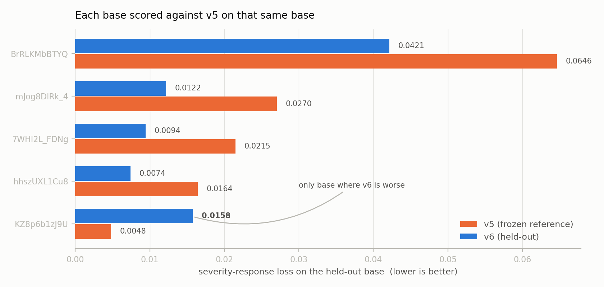
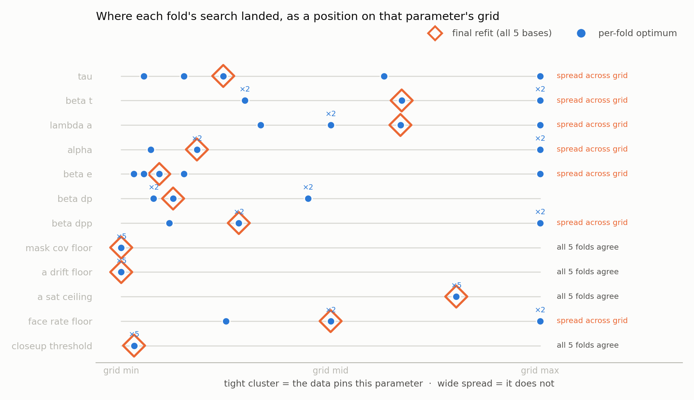

# Weekly report — sensitivity calibration of the long-range consistency metric

## What this covers

The consistency metric (LR-VCC) is a no-reference composite that scores how stable a
super-resolved long video stays over its full duration. It combines seven sub-metrics
— appearance, temporal, identity, two colour-stability measures, an anchored colour-drift
measure, and a CLIP-feature trajectory — through a reliability-weighted softmax over a
log-mean.

Alongside it there is a validation battery: twelve synthetic corruption families applied
to five long base videos at five escalating severities, 300 clips in all. Until now that
battery was only a *validator* — it told us which corruptions the metric caught and which
it missed. This week it became a *calibration signal*: the metric's response parameters
were fitted against it, under cross-validation, producing a candidate next version of the
metric and — more usefully — a per-cell account of why the current one fails where it does.

The previous configuration stays frozen and bit-reproducible throughout. Nothing was
rewritten retroactively.

## The approach, and why it is shaped this way

**The battery as an objective.** Each corruption family carries a prediction registered in
advance: six families the metric was designed to detect should respond monotonically as
severity rises, and control families should stay silent — a horizontal mirror flip
preserves colour statistics by construction, so a metric that reacts to it is reacting to
change rather than to inconsistency. The loss rewards a monotone response of a target
magnitude on the first group and penalises any response at all on the second, with the
silence penalty weighted more heavily than the response term. Over-calibration is the
failure mode being guarded against: a metric tuned to react to everything is not a
better metric.

**Reading the whole severity ladder.** The old verdict protocol compared only the two
endpoints of each ladder. The three intermediate severities were being computed and
discarded. The loss now uses all five, so a non-monotone response is penalised rather
than averaged away.

**Cross-validation, not in-sample fitting.** With five base videos, a fit reported on the
same videos it was tuned on proves nothing. Every reported number comes from leave-one-base-out
folds: fit on four bases, evaluate on the fifth, rotate. Each of the five held-out columns
therefore comes from a fit that never saw its own video. This is enforced by a test that
intercepts the actual arguments of every call made inside a fold's search — not by
checking the labels the code writes for itself — because that disjointness is the whole
basis for believing the numbers.

**A guard on the headline result.** Any parameter vector that breaks the established method
ranking is rejected outright. The calibration is not permitted to buy validation-matrix
cells by degrading the leaderboard.

Everything runs from cached sub-metric outputs on a laptop in seconds — no GPU, no
re-scanning of video. That matters for iteration speed and it means anyone can re-run it.

## Results

**On the fit objective, the new version improves on four of five held-out videos.**

Each pair compares the two versions *on the same held-out video*. This pairing matters more
than it sounds: an earlier iteration of this analysis compared a single-video score against
a five-video aggregate, which made the hardest base look like the one regression. It is
actually the largest improvement — that base is simply hard, and the old version scores far
worse on it. The genuine regression is `KZ8p6b1zJ9U`. Mean held-out loss falls from 0.0269
to 0.0174, a 35% reduction.

**On the verdict count, nothing improved.**

| | designed-for families | control families | as-designed total |
|---|---|---|---|
| current version | 25/40 | 14/15 | **39/55** |
| candidate, held out | 24/40 | 15/15 | **39/55** |
| candidate, in-sample | 30/40 | 12/15 | 42/55 |

This is the result I would most like a second opinion on. The loss improved substantially
and the pass/fail count did not move at all: the designed-for families lost a cell, the
controls gained one. There are two real qualitative wins underneath — four cells where the
old version actively *rewarded* the corruption now merely fail to notice it, and every
control family stays silent on its held-out video — but the headline count is flat.

The in-sample row is worth reading as a warning rather than a result: with every video in
view, the fit sacrifices three control cells to buy response elsewhere. The held-out folds
show that trade does not survive to an unseen video. That is exactly the over-calibration
the silence penalty exists to catch, and it is visible only because the split was kept
honest.

**The parameters are not pinned down by five videos.**

Each row shows where each fold's independent search landed on that parameter's grid. Where
the five folds agree, the data constrains the parameter. Where they scatter across the grid
— or sit at its edge — it does not: the optimum is at or beyond the boundary of the space
searched, and that parameter is being set by noise. Roughly half the parameters are in the
second category. A one-parameter-at-a-time loss scan agrees: the loss is sharp in the
softmax temperature and the temporal response, and essentially flat in several of the gate
thresholds.

I read this as the clearest signal that the fit is data-starved rather than mis-designed.

**One structural finding that outlives the fit.** Every non-conforming cell was attributed
to the stage where the signal was lost: the raw statistic never moved, it moved but the
score went the wrong way, the score barely moved despite a large raw change, the score
moved but carried almost no weight, or it responded and was cancelled by other sub-metrics.
Of 34 attributed findings, **20 are reachable by refitting constants and 14 are not** — the
latter need a different measurement, not a different number. That count is a ceiling: no
amount of calibration recovers those cells.

Two mechanisms dominate the reachable ones. The composition step weights sub-metrics by
whether their *inputs* are trustworthy, never by whether they are *responding*, so
sub-metrics that are reliably blind to a given corruption can outvote the ones that detect
it. And the temporal sub-metric had no response parameter at all — its raw signal moves by
50–95% on flicker while its score moves by 0.05. Giving it one was the single largest lever;
notably, the option of keeping its original form was left in the search grid and the fit
did not take it.

## Where I would value input

1. **Is a flat conformance count with a 35% loss reduction worth shipping as a new version?**
   My inclination is no — to keep the current version as the reference, treat this as
   infrastructure, and re-fit once the video set grows. But the argument for shipping is
   that the four reward-direction cells becoming inert is a real improvement the count
   simply cannot express, which may say more about the count than the metric.
2. **Is the target response curve the right target?** The loss currently asks for a monotone
   drop of a fixed magnitude. That is a placeholder for a perceptual target — no human
   severity ratings exist yet, so the shape is asserted rather than measured.
3. **The reward-direction failures.** The identity sub-metric *rises* on some videos as
   identity degrades, from a known pooling pathology. That is a measurement problem, and I
   would rather replace the measurement than keep compensating around it.
4. **Grid boundaries.** Several folds optimise to the edge of the searched range. Widening
   the grids is easy; knowing whether an extreme value is meaningful or is overfitting five
   videos is not.

## Reproducing it

Four generated reports carry the full detail — the five-point response curves per cell, the
matrix rescored against the registered predictions, the per-cell failure attribution, and
the cross-validation results with per-fold parameters and loss surfaces. The fit itself is
one command from a cached table and takes under a minute end to end. Every number in this
report is regenerated from that table rather than transcribed.

## Next

The blocking dependency for the *calibration* side is the video set — every limitation
above is a sample-size limitation. When the additional long-video footage lands, the same
code re-runs unchanged on a larger, stratified set, and the calibration/validation split
stops being five folds over five videos.

The structural side does not depend on that, and is now drafted as its own design. The
work list comes from the 14 structural findings rather than from intuition:

| sub-metric | structural findings |
|---|---:|
| identity | 6 |
| appearance | 5 |
| CLIP trajectory | 2 |
| anchored colour histogram | 1 |

**Identity is the dominant item, and the mechanism is now pinned.** The sub-metric scores
within-clip embedding self-similarity with no reference, so it cannot distinguish
*consistently the right person* from *consistently a blur*. The battery shows per-clip
scores rising as identity degrades — 0.767 → 0.933 on one clip, 0.05 → 0.80 on another,
fused 0.375 → 0.489 — and identity carries roughly five times the weight of the
sub-metrics that correctly detect the corruption. No choice of constants inverts a
monotone-increasing response.

The proposed fix repeats a move that already worked here: anchor it. The self-referential
colour histogram was flat on colour drift on 0 of 5 videos; the anchored variant reached
4 of 5. An anchored identity measure scores each clip against a reference identity built
from the video's own high-confidence early clips, so a washed-out face reads as *far from
the reference* rather than as pleasingly self-consistent.

Two corrections to what I said previously, both from looking at the attribution rather
than trusting memory:

- **A mirror-sensitive sub-metric is not justified and is now a stated non-goal.** The
  horizontal-flip family is a silent *control* — staying flat is its correct outcome, it
  conforms on all five videos, and it contributes zero structural findings. Building
  mirror sensitivity would fix nothing and would put a passing control at risk.
- **Some of the 14 are probably bookkeeping, not measurement failures.** Appearance is
  declared as a target for background drift, identity degradation and channel shuffle —
  corruptions that leave each frame individually plausible, so per-frame quality
  genuinely should not move. Auditing that declaration costs no compute and comes first,
  precisely so a narrowed expectation cannot later be mistaken for a metric improvement.

Unlike the calibration work, this needs GPU time: a changed measurement means re-scanning
the battery. It composes with the enlarged video set rather than competing with it.
