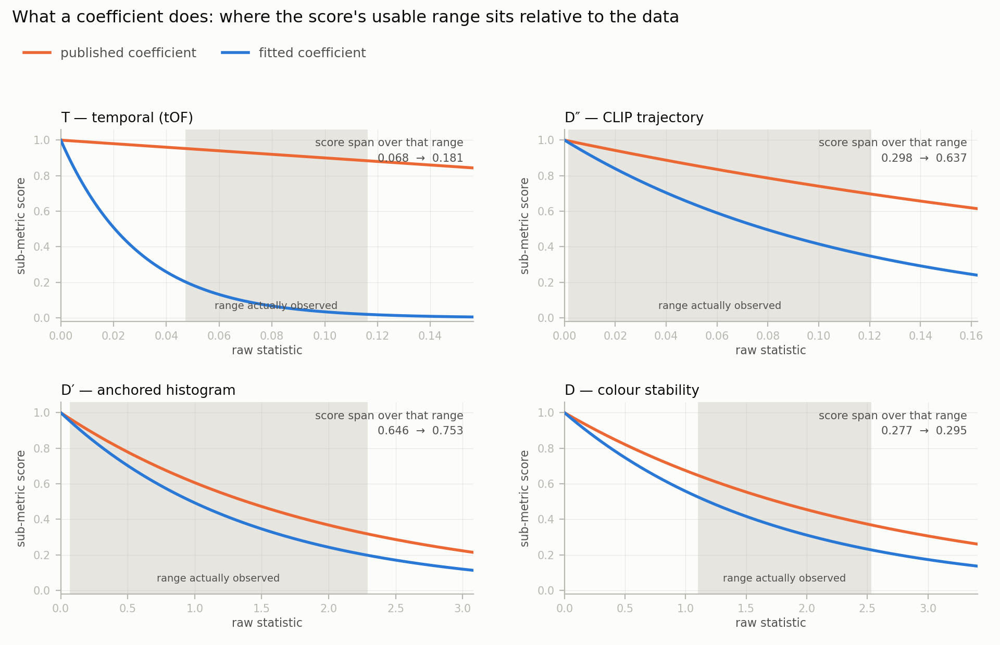
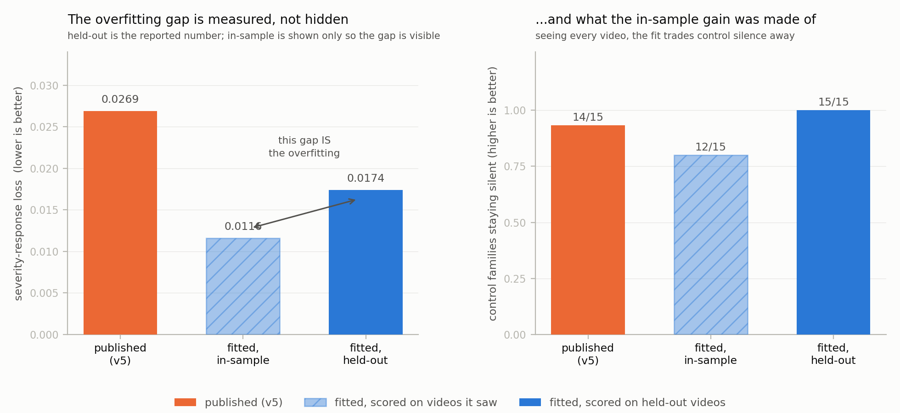

# Coefficient calibration, explained

How the consistency metric's coefficients are fitted, why we changed values that
were already published, which sub-metrics those changes touch, and why the result
is not overfitting.

---

## 1. What a coefficient actually is

Every sub-metric measures something raw, then converts that raw number into a
score in [0, 1] through a small function with one coefficient in it:

```
D   colour stability    score = exp(−α · mean_histogram_distance)
D′  anchored histogram  score = exp(−β · |quarter4 − quarter1|)
D″  CLIP trajectory     score = exp(−β · |quarter4 − quarter1|)
T   temporal            score = exp(−β · weighted_mean_tOF)     ← was 1 − x
A   appearance          score = mean(quality) − λ · std(quality)
```

The coefficient does one job: **it decides how big a raw change has to be before
the score notices.** Too small and you get a dead zone — real corruption arrives
and the score barely moves. Too large and you get saturation — the score bottoms
out immediately and can no longer tell mild from severe.

Put differently: the coefficient positions the score's *usable range* relative to
where the data actually lives. Get it wrong and the sub-metric measures something
real and then throws the information away in the conversion.

---

## 2. Why we changed coefficients that were already published

### They were never fitted in the first place — by design

In the published version the coefficients were **chosen a priori from independent
characterisations and deliberately not tuned.** The original design says so
explicitly: pick the thresholds from prior characterisation, document them, and
do not tune after seeing results.

That was the right call for a first version. It is the honest way to avoid fitting
a metric to its own test set. But it leaves a question unanswered: *were those
a priori guesses any good?* Nobody had ever checked.

### They were not. Here is the evidence



The shaded band in each panel is the range of raw values that sub-metric actually
produces across the whole battery (5th–95th percentile). The orange curve is the
published coefficient, blue is the fitted one. What matters is how much vertical
distance the curve covers **inside the band** — that is the sub-metric's entire
usable dynamic range.

| sub-metric | raw range observed | score span, published | score span, fitted |
|---|---|---:|---:|
| **T** — temporal | 0.048 – 0.116 | **0.068** | 0.181 |
| **D″** — CLIP trajectory | 0.002 – 0.120 | **0.298** | 0.637 |
| **D′** — anchored histogram | 0.070 – 2.283 | 0.646 | 0.753 |
| **D** — colour stability | 1.107 – 2.525 | 0.277 | 0.295 |

Read the T row carefully, because it is the clearest case. Over its *entire*
observed range, the temporal sub-metric's score moved by **0.068**. It was
measuring optical-flow disruption perfectly well and then compressing that signal
almost out of existence before the composite ever saw it.

This is not a tuning preference. It is a sub-metric that could not express what it
had measured.

---

## 3. Which sub-metrics changed, and what changed for each

All twelve fitted numbers, published → fitted:

| | coefficient | published | fitted | changed? |
|---|---|---|---|---|
| composition | `tau` softmax temperature | 0.2 | **1.256** | ✅ largest single change |
| T | `beta_t` | *linear* `1−x` | **33.81** | ✅ new parameter |
| A | `lambda_a` drift weight | 0.5 | **2.0** | ✅ |
| D″ | `beta_dpp` | 3.0 | **8.78** | ✅ |
| D′ | `beta_dp` | 0.5 | **0.707** | ✅ |
| D | `alpha` | 0.394 | **0.583** | ✅ |
| E | `beta_e` | 200 | 200 | — unmoved |
| gate | A drift floor | 0.02 | **0.0** | ✅ |
| gate | T mask-coverage floor | 0.10 | **0.0** | ✅ |
| gate | A saturation ceiling | 0.98 | 0.98 | — unmoved |
| gate | I face-rate floor | 0.20 | 0.20 | — unmoved |
| gate | I close-up threshold | 0.05 | 0.05 | — unmoved |

Four of twelve did not move at all. That is worth saying out loud: the fit was
free to move every number and chose to leave a third of them alone.

### The three changes that matter most

**`tau`, 0.2 → 1.256 — the composition temperature.** This is not a sub-metric
coefficient; it fixes a design flaw in how sub-metrics are *combined*. Weights are
derived per video as `softmax(reliabilities / tau)`, and **reliability answers
"can I trust this sub-metric's input", never "is this sub-metric responding".**
The colour sub-metrics sit at reliability ≈ 1.0 on almost every video, so a sharp
softmax let them dominate cells where they were blind or actively anti-correlated.

A worked case — flicker on one base video:

| | A | T | I | D | E | D′ | D″ |
|---|---|---|---|---|---|---|---|
| score change as severity rises | −0.032 ✅ | −0.052 ✅ | +0.001 | +0.012 ❌ | +0.037 ❌ | +0.057 ❌ | −0.028 ✅ |
| weight | 0.039 | 0.130 | 0.206 | 0.207 | 0.005 | 0.207 | 0.207 |

The two sub-metrics that correctly detect flicker hold **0.17** of the weight;
three moving the *wrong* way hold **0.42**. The signal exists and the composition
cancels it. A flatter softmax lets responsive sub-metrics carry weight.

**`beta_t`, linear → 33.81 — the temporal sub-metric.** It previously had no
response coefficient at all; the mapping was hardcoded as `1 − x`. That linear map
is what produced the 0.068 span above. Importantly, **the original linear form was
left in the search grid as an option and the fit did not choose it** — the new
coefficient was adopted on evidence, not imposed.

**`mask_cov_floor`, 0.10 → 0.0 — a gate, not a scale.** This one changes T's
*input set* rather than its scaling: it disables the flow-coverage filter, so time
scales previously discarded now contribute. Worth flagging because it is a
behavioural change hiding in what looks like a threshold tweak.

---

## 4. Why this is not overfitting

Three independent guards, plus the honest reporting of what leaked through.

### Guard 1 — nothing is reported on videos the fit saw

Twelve coefficients against five videos: fitting and grading on the same set
measures memorisation. So every reported number comes from **leave-one-out
rotation** — fit on four videos, evaluate on the fifth, rotate five times. The
reported matrix has every cell produced by coefficients blind to its own video.

The subtlety that usually breaks this: the leaderboard guard compares methods on
the same five videos, so evaluating it globally while fitting on four would leak
the held-out video back in through the guard. It is restricted to each fold's
training videos, and there is a test that **intercepts the actual arguments of
every call made during fitting** to prove it — rather than trusting labels the
code writes about itself.

### Guard 2 — control families make "react to everything" unprofitable

Fitting a metric to detect corruption has a trivial cheat: react to *any* change.
So a quarter of the objective is **silence constraints** on families that are
physically invisible to the metric — a horizontal mirror flip preserves colour
statistics exactly and CLIP embeddings are flip-robust, so flat is the *correct*
answer there, not a failure. Those constraints are weighted **3×** the response
term, because over-calibration is the failure mode the fit is actively searching
toward.

### Guard 3 — the leaderboard cannot be traded away

Any coefficient set that inverts the established method ranking is rejected
outright. The calibration cannot buy validation-matrix cells by degrading the
headline result.

### The evidence that the guards are load-bearing



The left panel is the gap: in-sample **0.0116** versus held-out **0.0174**. We
report the held-out number; the in-sample one is shown *only* so the gap is
visible. That difference is the overfitting, quantified rather than hidden.

The right panel shows what the in-sample gain was made of. With every video in
view, control-family silence drops to **12/15** — the fit really does trade away
control silence to buy response elsewhere. On held-out videos it is **15/15**, so
the trade does not generalise. **The guard caught a live attempt, not a
hypothetical one.**

### Guard 4 — determinism

Coordinate descent over fixed log grids, fixed parameter order, no randomness, run
to convergence rather than to an iteration budget. The same inputs always produce
the same coefficients — the result is not a lucky seed.

---

## 5. The caveats we are not hiding

**Roughly half the coefficients are not identified by five videos.** Each fold
runs an independent search; where the five folds agree, the data pins the
coefficient, and where they scatter across the grid — or optimise to its edge —
it does not.


A one-coefficient-at-a-time loss scan agrees: the loss is sharp in `tau`,
`beta_t`, `lambda_a` and `beta_dp`, and essentially flat in several of the gate
thresholds — meaning those gates are being set by noise, not evidence.

**`beta_t = 33.81` drives the temporal score very low in absolute terms**
(≈0.20 → 0.02 across its range). The composite is a geometric mean so relative
movement is what counts, but a sub-metric pinned near zero is a legitimate thing
to be suspicious of at this sample size.

**The verdict count did not improve.** Held-out loss fell 35%; the as-designed
conformance count is unchanged at 39/55. The fit objective and the reader-facing
count measure different things, and at five videos we cannot resolve which moved
for real reasons.

**So the fitted version is not adopted.** The published configuration remains the
reference. The recommendation is to treat this as infrastructure and re-fit once
the video set grows — every limitation above is a sample-size limitation, and the
same code re-runs unchanged on a larger set.

---

## 6. Why re-running it is cheap

Each sub-metric's raw statistic is extracted from video once and cached. The fit
then recomposes the whole 315-clip matrix as pure arithmetic — no video decoding,
no network forward passes. A full matrix recomposition went from 2.7 s to under a
millisecond, which is what makes a five-fold search over a real grid affordable on
a laptop; the entire fit finishes in under a minute.

The correctness gate for that shortcut: the fast path must reproduce the canonical
implementation **bit-exactly** at the published coefficients. It does — 0.0
worst-case difference across all 315 clips, pinned as a regression test, so the
published configuration cannot drift silently underneath us.

---

## 7. What the calibration actually bought us

The coefficient fit is the visible output, but it is not the most valuable one.
Running it forced every failing cell in the validation matrix to be attributed to
*the stage where the signal was lost* — and that attribution is what turned a list
of failures into a work plan.

Five stages, of which only three are reachable by changing numbers:

| stage | what it means | fixable by refitting? |
|---|---|---|
| normalisation | raw statistic moved a lot, score barely did | ✅ |
| gate | score moved but carried almost no weight | ✅ |
| composition | responded correctly, but other sub-metrics cancelled it | ✅ |
| **measurement** | the raw statistic never moved at all | ❌ |
| **reward-direction** | the score moved the *wrong* way | ❌ |

**20 findings are addressable by coefficients; 14 are not.** That second number is
the honest ceiling on what any amount of calibration can deliver, and it is only
knowable because the fit was run.

### Where the 14 sit

| sub-metric | structural findings |
|---|---:|
| identity | **6** |
| appearance | **5** |
| CLIP trajectory | 2 |
| anchored histogram | 1 |

### Two follow-ons this produced

**A correction to the declaration, not the metric.** Some of those 14 are
bookkeeping rather than defects. Attribution records a failure whenever a
*declared* sub-metric fails to respond — so if a sub-metric was never physically
capable of responding to a family, the non-response is an artefact. Appearance is
declared for corruptions that leave every frame individually plausible (background
drift, channel shuffle, face-local degradation), where per-frame quality genuinely
should not move. Removing those declarations takes the counts to 27 findings and
**11 structural**.

That audit is written but deliberately **not applied**: narrowing the map improves
the numbers without improving the metric, so it has to be frozen before any
replacement measurement exists, or it could be shaped to flatter one. Two checks
keep it honest — it shrinks *both* classes, leaving the structural share at 41%
before and after, and one of its four removals changes no number at all and is
proposed purely on mechanism.

**The largest structural item now has a mechanism, not just a symptom.** The
identity sub-metric's tracker is re-created for every two-second clip, so the
reference face is re-initialised roughly eighty times per video and the score is a
*within-clip self-similarity* — the fraction of frames matching that clip's own
first face. It therefore cannot distinguish *consistently the right person* from
*consistently a blur*, and degradation collapses embeddings toward each other so
the score **rises**: fused 0.375 → 0.489 as identity degrades, while the
sub-metric carries roughly five times the weight of those that detect the
corruption correctly.

This is the cleanest illustration of the coefficient/measurement boundary that
this whole document is about. Section 2 showed coefficients that were compressing
a real signal — fixable by refitting. This is a signal pointing the wrong way, and
**no choice of constants inverts a rising response.** It needs a different
measurement: anchor each clip against a reference identity built from the video's
own high-confidence opening clips rather than against its own first frame. The
precedent is in this benchmark already — the self-referential colour measure was
blind to colour drift on 0 of 5 videos; the anchored variant reached 4 of 5.

That work is underway, built the same way as the calibration harness: extract the
expensive statistic once and make every design variant cheap offline arithmetic,
with a replay of the *existing* scoring as a correctness gate. The gate has
already paid for itself — on the first processed video it flagged a discrepancy
against the committed numbers (0.6859 replayed against 0.6836 stored, with clip
and face-detection counts identical), traced to battery clips that had to be
regenerated after the originals were pruned. Video re-encoding is not
bit-identical, so both sides of every comparison now have to come from the same
files. A 0.002 discrepancy is small; silently inheriting it into every
anchored-identity comparison would not have been.
