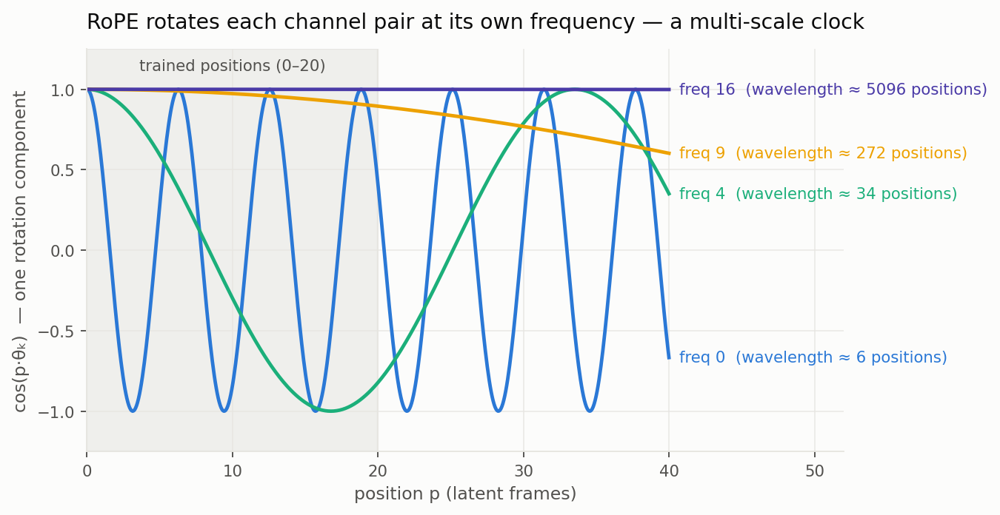
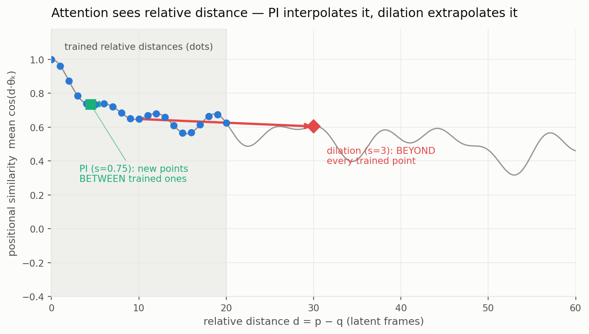
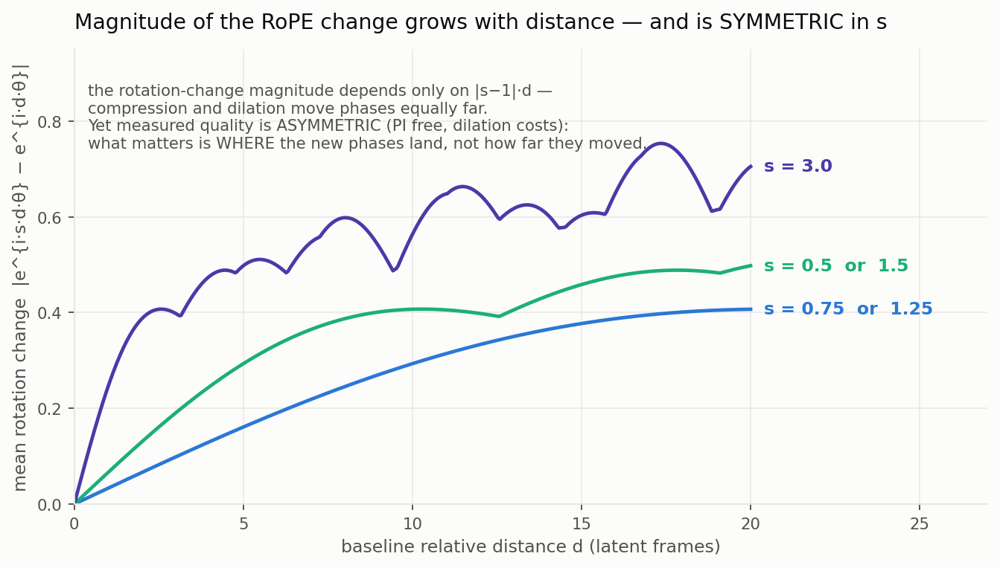
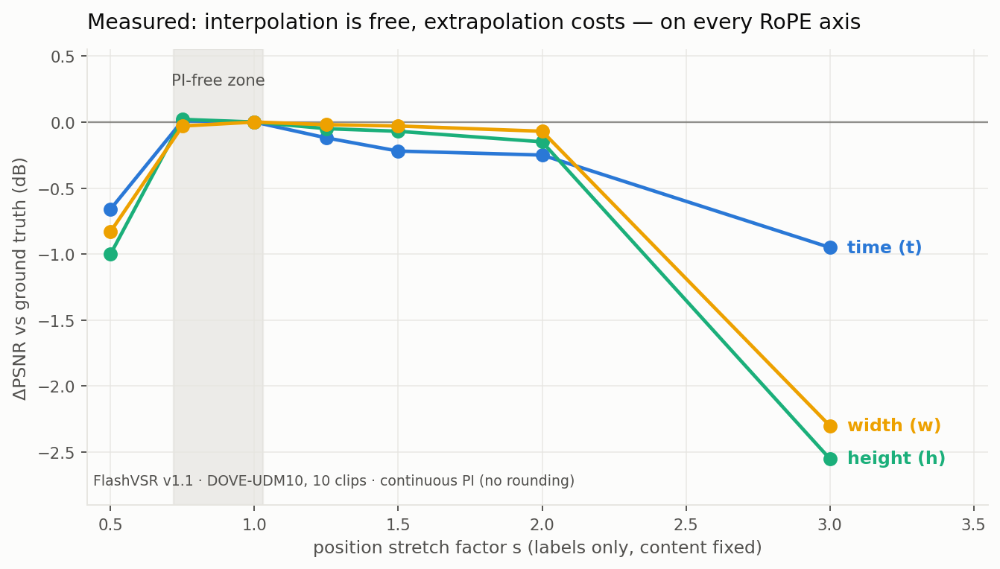

# Position Interpolation, in Detail

**Timur Iakshibaev · group presentation · 2026-07 · all parameters and
measurements from FlashVSR v1.1 (Wan2.1 DiT, 3D RoPE)**

---

## 1. What RoPE actually is

Each attention head splits its channels into pairs; pair *k* is rotated by
the angle **p·θ_k**, where *p* is the token's position and the frequencies
θ_k = 10000^(−2k/d) form a geometric ladder from fast to slow. It is a
multi-scale clock: the fastest hand completes a turn every ~6 positions, the
slowest barely moves across a whole clip.

FlashVSR's temporal axis: d = 44 → **22 frequencies**; trained clips are 81
frames = **21 latent positions (0–20)** — the grey band. Everything beyond
is territory the weights never saw.

## 2. What attention consumes: relative distance

Query at position *p* is rotated by p·θ, key at *q* by q·θ; their dot
product depends only on the **difference (p−q)·θ**. So training taught the
model an attention response at ~20 discrete relative distances per
frequency — the dots below. This is also why RoPE is "relative": shifting
all positions by a constant changes nothing (we verified: +996 positions →
+0.001 dB).

Two ways to place *new* inputs on this curve:

- **Position Interpolation (green):** multiply positions by s < 1 → all
  relative distances shrink → new query points sit **between** trained dots.
- **Dilation / extrapolation (red):** distances grow → query points sit
  **beyond every trained dot**, where the learned response is unconstrained.

## 3. How PI is computed (and the two traps)

Positions are compressed **continuously**: [4, 5, 6] × 0.75 → [3.0, 3.75,
4.5]. Two implementation facts that came up in our discussions:

1. **No duplicated positions.** Naive integer rounding maps [4,5]×0.5 →
   [2,2] — two frames claim the same instant (zero rotary distance). True PI
   keeps every position unique and fractional.
2. **No table indexing, no row averaging.** Stock RoPE precomputes phases at
   integer positions as an optimization; the encoding itself is a continuous
   function. For p = 3.75 we **evaluate** e^(i·p·θ) directly — we never
   interpolate between table rows (averaging complex phases is wrong: it
   biases the angle and shrinks the magnitude). Validation: evaluated at
   integer positions, this reproduces stock behaviour exactly (identity
   condition scored at the pipeline's numerics floor, 53.4 dB).

## 4. The magnitude of the RoPE change vs relative distance

How far does a stretch *s* actually move the rotations? Per frequency the
phase shifts by (s−1)·d·θ_k; averaged over frequencies as a chord distance:

Three things to read off:

- Change is **zero at d = 0** and grows with distance — nearby tokens are
  barely disturbed, far tokens strongly.
- The magnitude depends only on **|s−1|·d**: compression by 0.75 and
  dilation by 1.25 move the phases *exactly equally far*.
- **Therefore magnitude cannot explain the quality asymmetry.** If "how much
  the encoding changed" determined damage, s = 0.75 and s = 1.25 would cost
  the same. They don't (next figure) — proof that what matters is **where
  the new phases land**: inside the trained range (interpolation, smooth,
  well-behaved) or outside it (extrapolation, unconstrained).

## 5. The measurements (ours, vs real ground truth)

DOVE-UDM10, 10 clips, pyiqa/DOVE convention, per-axis position stretches
with content fixed; baseline 24.02 dB (MGLD's verified number on the same
protocol: 24.23):

| stretch s | time | height | width |
|---|---:|---:|---:|
| 0.5 | −0.66 | −1.00 | −0.83 |
| **0.75 (PI)** | **+0.01** | **+0.02** | **−0.03** |
| 1.25 | −0.12 | −0.05 | −0.02 |
| 1.5 | −0.22 | −0.07 | −0.03 |
| 2.0 | −0.25 | −0.15 | −0.07 |
| 3.0 | −0.95 | −2.55 | −2.30 |

- The **PI-free zone is real and universal** (every axis, +0.01 dB at 0.75).
- **Extrapolation costs monotonically**, up to −2.6 dB spatially.
- **The PI-free zone is narrow.** At s = 0.5, neighbouring tokens sit at
  relative distance 0.5 — *below the minimum nonzero distance ever trained*
  (1.0): interpolation between the "self" point and the "nearest-neighbour"
  point, where attention behaviour changes qualitatively. That is the
  boundary of zero-shot PI, and why the LLM literature pairs aggressive PI
  with fine-tuning (Chen et al., 2023).

## 6. Practical consequences

1. **Window extension** (21 → N latents): PI at s = 21/N is predicted
   RoPE-loss-free up to N ≈ 28 (s = 0.75); beyond ~2× the compression cost
   itself appears. Our hook applies this per axis with zero model changes.
2. **Resolution extension:** measured on real grids — 1.5× spatial growth
   costs only −0.15 dB *without* PI, and spatial PI there **hurts** (−0.56,
   factor 0.67 is past the free zone). Do not apply spatial PI at ≤1.5×.
3. **Absolute position growth** (long streaming) is free everywhere — the
   danger axis is relative-distance geometry, never magnitude.

## Anticipated questions

- *"Fractional phases are new values — isn't that OOD?"* New ≠ OOD. Harm
  comes from leaving the convex hull of trained relative phases
  (extrapolation), not from landing between trained points (interpolation of
  a smooth learned function). Figures 3+5 together are the empirical proof:
  equal phase movement, opposite quality outcomes.
- *"Why not interpolate the table rows?"* Complex-phase averaging is
  mathematically wrong (angle bias, magnitude shrink); exact evaluation is
  simpler and provably faithful.
- *"Does PI fix long videos?"* No — long-video drift is not positional at
  all (three causal arms indistinguishable). PI's use-case is *window/
  distance* extension, in its narrow free zone.

*Sources: `reports/rope_timespace_sensitivity_matrix.md` (full study),
`docs/notes/2026-07-11-rope-extrapolation-findings.md` (verdicts),
figure script: session scratchpad `make_pi_figs.py` (θ and window from the
FlashVSR checkpoint config).*
