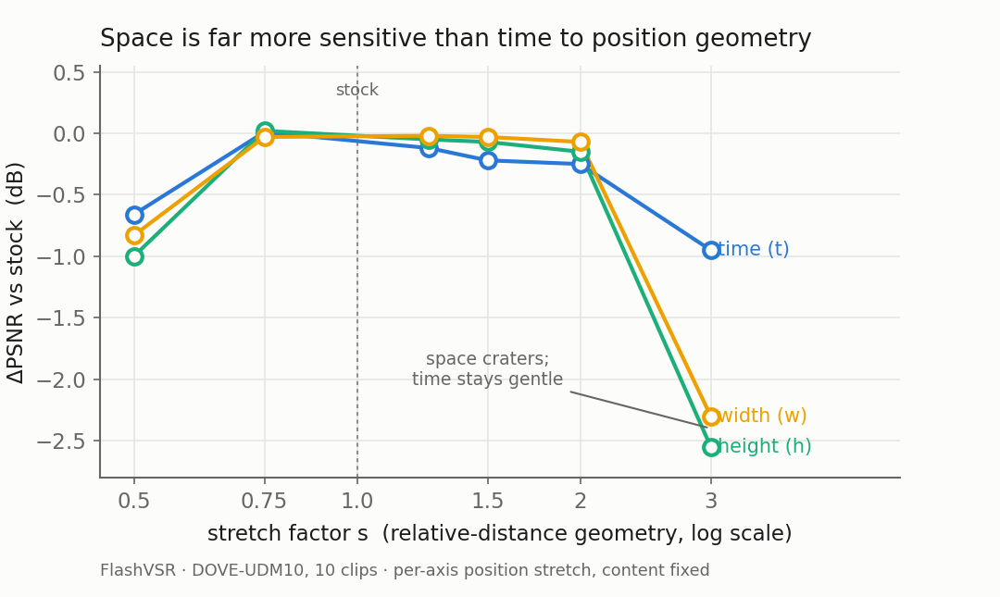
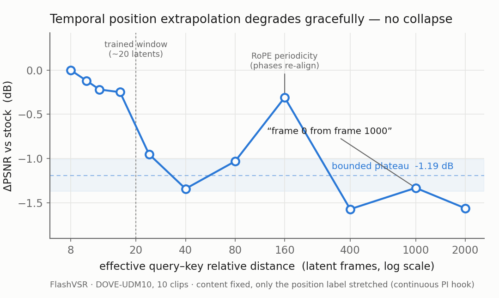

# Comprehensive RoPE Sensitivity in Time and Space — FlashVSR

**Timur Iakshibaev · answering the group's ask:**
*"characterise RoPE sensitivity separately in the spatial (h, w) and temporal
dimensions, on real data, including direct resolution extrapolation."*

## 1. Question and background

FlashVSR's Wan2.1 DiT encodes position with **3D RoPE**: three separate
frequency tables for time, height, and width. The model trains on 81-frame
clips (= 21 latent frames after 4× VAE compression) at up to ~768×1408
(latent H-extent 48). Anything longer or larger forces RoPE to operate
outside its trained range. The question: **which kinds of positional
extrapolation actually cost output quality, per axis?**

## 2. Method (summary)

- **Instrument:** a runtime position-injection hook that swaps any one RoPE
  table for a wrapper transforming baseline positions — constant **offset**
  (shift), **geometry** scaling (stretch; continuous, i.e. true Position
  Interpolation without integer rounding), or cycling (modulo) — with
  on-demand table extension past the stock 1024 rows. The hook is **bit-exact
  when idle** (no-op output identical to stock on a measured-zero
  nondeterminism floor) and engagement-checked; the model repo is never
  modified. 48 unit tests.
- **Scoring:** PSNR/SSIM/LPIPS vs **real ground truth**, pyiqa with the DOVE
  RGB convention (identical to our verified MGLD/UAV baseline numbers).
  Sanity anchor: stock FlashVSR scores 24.02 dB on DOVE-UDM10, beside MGLD's
  verified 24.23 on the same protocol.
- **Data:** label sweeps on DOVE-UDM10 (10 clips × 29 frames, realistic
  degradation); resolution ladder on YouHQ40 (8 clips, 1080×1080 GT,
  270×270 LQ). Long-video arms on the 5 long benchmark videos (2412–5000
  frames, no GT → drift metric D″).

## 3. Results

### 3.1 Position labels only (content and compute fixed) — ΔPSNR dB vs stock

| stretch s | time (t) | height (h) | width (w) |
|---|---:|---:|---:|
| 0.5 (compression) | −0.66 | −1.00 | −0.83 |
| **0.75 (PI zone)** | **+0.01** | **+0.02** | **−0.03** |
| 1.25 | −0.12 | −0.05 | −0.02 |
| 1.5 | −0.22 | −0.07 | −0.03 |
| 2.0 | −0.25 | −0.15 | −0.07 |
| 3.0 (extreme) | −0.95 | **−2.55** | **−2.30** |

**Offsets (translation) are free on every axis** — temporal shift to
position 996 (≈ 50× beyond the trained window): +0.001 dB; spatial shifts
8/24: ±0.003 dB; identical at every stretch level (no interaction).

Temporal caveat: under streaming, FlashVSR's attention span is ~8 latents,
so relative distances stay inside the trained 21-latent range until s≈2.6 —
the small s≤2 costs are *within-window* geometry effects; s=3 is the first
genuinely out-of-window condition. §3.5 pushes this axis to s=250 (distance
~2000, 100× the window): the temporal cost stays bounded (~−1.5 dB) and never
collapses.

### 3.2 Real resolution extrapolation (YouHQ40 ladder, actual grids)

| output | latent grid | input | stock vs GT | spatial-PI | PI − stock |
|---|---|---|---:|---:|---:|
| 720² | 48×48 (= trained extent) | crop | 24.70 dB | ≡ stock | — |
| 1152² | 72×72 (1.5×) | native | 24.55 | 24.00 | **−0.56** |
| 1280² | 80×80 (1.67×) | upsampled | 24.66 | — | — |
| 1408² | 88×88 (1.83×) | upsampled | 24.71 | — | — |
| 1536² | 96×96 (2.0×) | upsampled ×1.33 | **24.78** | — | — |

*(Grids from the run records; earlier drafts mislabelled them 45/72/90.
An earlier version of this table reported 13.69 dB at the top rung — that
was a scoring-geometry artefact, corrected below.)*

- **1.5× real grid growth costs only −0.15 dB** with stock positions.
- **Spatial PI at 1.5× hurts** (−0.56 dB vs simply extrapolating) —
  compressing to the trained extent (factor 0.67) sits in the
  compression-cost zone of §3.1.
- **Correction: the previously reported −11 dB "collapse" at 1536² was a
  scoring artefact, not a model failure.** The first scoring pass resized
  the full padded output frame (content = 93.75 % of it) against GT,
  comparing the two at different effective magnifications — a global
  misalignment. With content-correct scoring the 2.0× rung scores
  **24.78 dB — indistinguishable from every other rung.** The
  decomposition arms confirm all suspects cleared: pinning the attention
  sparsity to the healthy 1152² value changes nothing (24.74 vs 24.78);
  intermediate grids 80/88 are flat (24.66/24.71); an upsampled-input arm
  at fixed grid shows no blur penalty.
- **Strengthened conclusion: real resolution extrapolation is quality-free
  to at least 2.0× the trained spatial extent** with stock positions
  (adaptive sparsity included). The only positional effect on the ladder
  remains spatial-PI *hurting* at 1.5× (−0.56) — compression, not
  extrapolation, is the risky direction spatially.

### 3.3 Long videos (2412–5000 frames): drift is not positional

Three arms — stock segmented, true single-pass (positions to latent 1252 on
the extended table), and magnitude-bounded (positions cycled mod 336) — are
**indistinguishable on CLIP-trajectory drift (< 1 % relative spread)** on
every video. FlashVSR's long-video drift belongs to its streaming
cache/generation mechanism, not to position encoding. Bonus: the stock
4089-frame single-pass ceiling is purely the fixed 1024-row table — the
extended table sustained a 5009-frame single pass at 11.6 GiB VRAM.

### 3.4 Methodological finding

**Self-consistency does not predict quality:** s=0.75 and s=1.5 produce
identical output *change* (self-PSNR 31.8 both) but opposite GT verdicts
(+0.01 vs −0.22 dB). Position-perturbation studies need real references.

### 3.5 Extreme retrieval distance — "fetching frame 0 from frame 1000" (temporal)

A group question from the team meeting: in the local streaming window, when a
late frame retrieves an early one, we could re-base the early frame's position to a
small value or keep its *true* index — so the relative distance between "frame
1000" and "frame 0" is genuinely ~1000. Does the true, large distance cost
quality? Two facts frame it before any measurement.

**FlashVSR already uses the true index.** Its temporal RoPE index *is* the
absolute latent index (`4+2i`) and never resets. What keeps relative distances
small on a long stream is not re-basing but the **short KV cache** (~8-latent
attention span, §3.1 caveat): a query at "frame 1000" never forms an attention
edge to "frame 0" — that key was evicted hundreds of frames earlier. The
distance-1000 pair is a *latent* danger, never realised at inference. (The
re-based / window-local alternative is exactly SeedVR2's design so both options are shipping design choices, not a
hypothetical.)

**Isolating what the danger would cost.** We hold content fixed (a short clip
whose frames are genuinely adjacent) and inflate only the position *label* by
continuous stretch `s`; the in-window pair then sits at effective relative
distance ≈ `8s`. Same instrument as the §3.1 dilation sweep, pushed to the
extreme `s` the meeting asked about — so the two July questions (extreme
stretch; true-vs-rebased index) collapse to one experiment.

| stretch s | effective distance | vs trained window (~20) | PSNR (dB) | ΔPSNR |
|---|---|---|---:|---:|
| 1.0 (stock) | ~8 | in-window | 24.02 | — |
| 2 | ~16 | window edge | 23.78 | −0.25 |
| 5 | ~40 | 2× | 22.68 | −1.34 |
| 10 | ~80 | 4× | 23.00 | −1.03 |
| 20 | ~160 | 8× | 23.72 | −0.31 |
| 50 | ~400 | 20× | 22.46 | −1.57 |
| 125 | ~1000 | 50× — **"frame 0 from frame 1000"** | 22.69 | −1.33 |
| 250 | ~2000 | 100× | 22.47 | −1.56 |

*(DOVE-UDM10, 10 clips × 29 frames, temporal axis, continuous positions, vs
real GT; content and compute identical across rows — only the position label
changes. Baseline reproduces the established 24.02 dB exactly. The stock
1024-row table is bypassed by the continuous row-builder, so s=250 →
positions ~2000 runs with no table-extension crash.)*

Three reads:

1. **The loss is bounded and saturates — no collapse.** Even at 50–100× the
   trained window (distance ~1000–2000), quality sits at ~−1.3 to −1.6 dB,
   barely worse than the −0.95 dB already seen at s=3 (§3.1). Temporal position
   extrapolation degrades *gracefully* — the model loses fine relative-distance
   information but does not blow up. This is the opposite of the spatial axes,
   where s=3 *alone* costs −2.3 to −2.6 dB (§3.1): **time is far more forgiving
   of extreme extrapolation than space.**
2. **The curve is non-monotonic — RoPE frequency periodicity.** It is not a
   clean ramp: s=20 recovers to −0.31 dB, between the ~−1.0 dB neighbours at
   s=10 and s=50. Rotary phases are periodic (mod 2π), so certain large stretch
   factors accidentally re-align the fast frequencies near trained-like
   configurations. **"How far beyond the window" does not by itself set the
   damage — *where the phases land* does** (the same "where, not how far" point
   as the §5 symmetry argument, now at extreme scale).
3. **The meeting's answer.** Using the true large index costs a *bounded*
   ~1.3 dB at distance 1000 — a real but modest penalty, not a catastrophe —
   and FlashVSR never even pays it, because its short cache prevents the far
   edge from forming. The absolute-index + short-cache design is safe by
   construction, which is also why long-video drift is not positional (§3.3).

## 4. Recommendations

1. **For the window-extension study:** temporal extension to ~1.33×
   (21→28 latents) with continuous-PI positions is predicted RoPE-loss-free;
   beyond that, temporal geometry costs grow but stay **bounded and graceful**
   — even 100× the window plateaus at ~−1.5 dB, never a collapse (§3.5), so
   RoPE alone will not be the wall a temporal window-extension hits. The
   validated hook (continuous PI, per-axis, zero model modification) is ready
   for the extended-window runs — comparing stock vs PI positions there
   isolates RoPE's causal share directly.
2. **Do not apply spatial PI at ≤1.5× resolution extension** — stock
   extrapolation is cheaper.
3. **Long-video and high-resolution improvement effort should not target
   position encoding.** RoPE is exonerated on every axis at every realistic
   operating point; the located failure modes are the streaming KV-cache
   (drift) and resolution-scaling mechanics (sparsity/windowing ≥1440²).

## 5. Why Position Interpolation helps at all (and when it stops)

A fair objection: fractional positions (e.g. 2.5) produce rotary phases the
model never saw — aren't those out-of-distribution too? The resolution
(Chen et al., 2023) is the distinction between **interpolation within the
trained range and extrapolation beyond it**. Attention consumes *relative*
phase, (p−q)·θ; training taught the model this function at ~20 discrete
distances per frequency. PI places new inputs *between* those trained
points, where a learned, smooth function is provably well-behaved;
extrapolation places them *beyond* the trained interval, where the same
learned function is unconstrained. "Novel value" is only harmful outside
the convex hull of training inputs, not merely off the training grid.

Our measurements are this theory's fingerprint — and its boundary:
interpolated positions at s=0.75 cost **nothing** (+0.01 dB, every axis),
while extrapolated distances cost up to −2.6 dB; but compression is not
infinitely safe: at s=0.5, *neighbouring* tokens sit at relative distance
0.5 — **below the minimum nonzero distance ever trained (1.0)** — i.e.
interpolation between the "self" point and the "nearest-neighbour" point,
where attention behaviour changes qualitatively. That is why the PI-free
zone is narrow (~down to 0.75) in a zero-shot setting, and why the LLM
literature pairs aggressive PI with fine-tuning. Implementation note: our
continuous PI evaluates the RoPE formula directly at fractional positions
(no table indexing, no row interpolation — averaging complex phases would
be incorrect); evaluated at integer positions it reproduces the stock
table bit-for-bit in effect (identity condition at the numerics floor).

## 6. Limitations

Single model (FlashVSR 1.3B distilled). All vs-GT clips are temporally
within-window (29–31 frames); deep-length (>81-frame) quality curves lack
public GT — lab-provided long HR footage would close this (conversion
tooling ready). The 1440² confound is not yet decomposed. Spatial trained
extent inferred from the distillation resolution.

